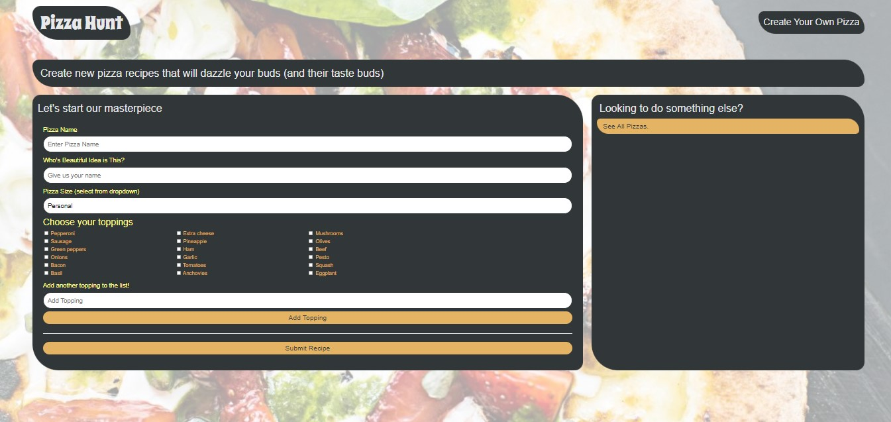

# Pizza Hunt

### Description
This full stack application uses a noSQL database, MongoDB and is a central location for pizza recipes. A user can open the application and even create their own pizza and can dynamically create their own topping as well to top the pie they have created. IndexedDB is a browser-based storage solution that is utilized for offline functionality.

### License

This application is licensed under MIT

### Application Demo

### Table of Contents
- [Description](#description)
- [Contributing](#contributing)
- [Tests](#tests)
- [Questions?](#questions)

### Contributing
No contributions at this time.

### Tests
N/A

### Questions
GitHub Username: (kcaseychamberlain) 

View the project in GitHub at: https://github.com/KCaseyChamberlain/pizza-hunt

View the application live hosted at: https://thawing-brushlands-18271.herokuapp.com/
    
If you have any questions, contact Casey at: caseygchamberlain@gmail.com